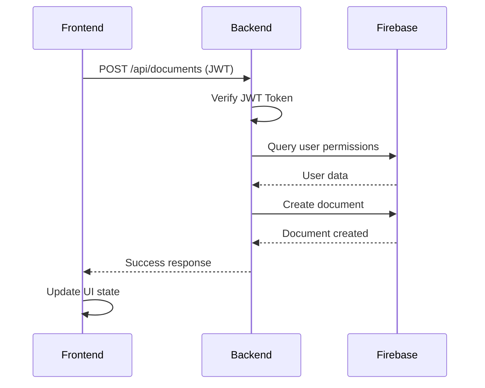
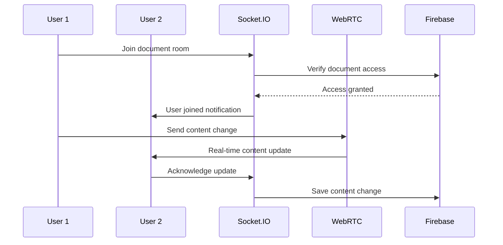

# How Firebase, JWT, and Real-time Features Work Together

## System Architecture Overview

This collaborative document editor uses a sophisticated architecture combining **Firebase Firestore**, **custom JWT authentication**, and **dual real-time communication** (Socket.IO + WebRTC) to create a seamless collaborative experience.

## 🔧 Component Interaction Flow

```
┌─────────────────────────────────────────────────────────────────────────────────┐
│                           CLIENT SIDE (React)                                  │
├─────────────────────────────────────────────────────────────────────────────────┤
│                                                                                 │
│  ┌─────────────────┐    ┌─────────────────┐    ┌─────────────────┐              │
│  │   AuthContext   │    │   Components    │    │   Real-time     │              │
│  │                 │    │                 │    │   Features      │              │
│  │ • JWT Storage   │◄──►│ • Dashboard     │◄──►│ • Socket.IO     │              │
│  │ • User State    │    │ • Editor        │    │ • WebRTC        │              │
│  │ • Token Refresh │    │ • Profile       │    │ • Cursor Track  │              │
│  └─────────────────┘    └─────────────────┘    └─────────────────┘              │
│                                                                                 │
├─────────────────────────────────────────────────────────────────────────────────┤
│                         SERVER SIDE (Express.js)                               │
├─────────────────────────────────────────────────────────────────────────────────┤
│                                                                                 │
│  ┌─────────────────┐    ┌─────────────────┐    ┌─────────────────┐              │
│  │   JWT Auth      │    │   API Routes    │    │   Real-time     │              │
│  │                 │    │                 │    │   Server        │              │
│  │ • Token Verify  │◄──►│ • Documents     │◄──►│ • Socket.IO     │              │
│  │ • User Lookup   │    │ • Users         │    │ • WebRTC Signal │              │
│  │ • Permissions   │    │ • Auth          │    │ • Rooms         │              │
│  └─────────────────┘    └─────────────────┘    └─────────────────┘              │
│                                                                                 │
├─────────────────────────────────────────────────────────────────────────────────┤
│                        DATABASE LAYER (Firebase)                               │
├─────────────────────────────────────────────────────────────────────────────────┤
│                                                                                 │
│  ┌─────────────────┐    ┌─────────────────┐    ┌─────────────────┐              │
│  │   Firestore     │    │   Collections   │    │   Realtime DB   │              │
│  │                 │    │                 │    │                 │              │
│  │ • NoSQL Store   │◄──►│ • users         │◄──►│ • Live Sessions │              │
│  │ • Queries       │    │ • documents     │    │ • Presence      │              │
│  │ • Security      │    │ • permissions   │    │ • Cursors       │              │
│  └─────────────────┘    └─────────────────┘    └─────────────────┘              │
│                                                                                 │
└─────────────────────────────────────────────────────────────────────────────────┘
```

## 🚀 Authentication Flow

### 1. User Registration/Login Process

```javascript
// Step 1: User submits credentials
const loginData = { email, password };

// Step 2: Backend validates against Firebase
const userDoc = await db.collection('users').doc(email).get();
const isValid = await bcrypt.compare(password, userDoc.data().password);

// Step 3: Generate JWT token
const token = jwt.sign(
  { userId: email },
  process.env.JWT_SECRET,
  { expiresIn: '7d' }
);

// Step 4: Store token in frontend
localStorage.setItem('token', token);
setUser(userData);
```

### 2. Request Authentication Process

```javascript
// Step 1: Frontend adds JWT to requests
const token = localStorage.getItem('token');
config.headers.Authorization = `Bearer ${token}`;

// Step 2: Backend middleware verifies JWT
const decoded = jwt.verify(token, process.env.JWT_SECRET);

// Step 3: Backend fetches user data from Firebase
const userDoc = await db.collection('users').doc(decoded.userId).get();
req.user = userDoc.data();
```

## 📊 Data Flow Architecture

### 1. Document CRUD Operations



### 2. Real-time Collaboration Flow



## 🔄 Real-time Features Integration

### 1. Socket.IO Implementation

**Purpose**: Primary real-time communication channel

```javascript
// Backend: Socket.IO with JWT authentication
io.use(async (socket, next) => {
  try {
    const token = socket.handshake.auth.token;
    const decoded = jwt.verify(token, process.env.JWT_SECRET);
    
    // Fetch user from Firebase
    const userDoc = await db.collection('users').doc(decoded.userId).get();
    socket.user = userDoc.data();
    next();
  } catch (error) {
    next(new Error('Authentication failed'));
  }
});

// Frontend: Socket connection with token
const socket = io(SERVER_URL, {
  auth: { token: localStorage.getItem('token') }
});
```

### 2. WebRTC Implementation

**Purpose**: Low-latency peer-to-peer communication

```javascript
// Frontend: WebRTC peer connection
const peerConnection = new RTCPeerConnection({
  iceServers: [
    { urls: 'stun:stun.l.google.com:19302' }
  ]
});

// Send cursor updates via WebRTC data channel
const sendCursorUpdate = (cursorData) => {
  if (dataChannel && dataChannel.readyState === 'open') {
    dataChannel.send(JSON.stringify({
      type: 'cursor-update',
      data: cursorData
    }));
  }
};
```

### 3. Hybrid Communication Strategy

```javascript
// Use WebRTC for low-latency updates
if (webrtcConnected) {
  sendCursorUpdate(cursorPosition);
} else {
  // Fallback to Socket.IO
  socket.emit('cursor-position', cursorPosition);
}
```

## 🔐 Security Integration

### 1. Multi-layer Security

```javascript
// Layer 1: JWT Token Validation
const authenticateToken = async (req, res, next) => {
  const token = req.headers.authorization?.split(' ')[1];
  const decoded = jwt.verify(token, process.env.JWT_SECRET);
  
  // Layer 2: Firebase User Lookup
  const userDoc = await db.collection('users').doc(decoded.userId).get();
  if (!userDoc.exists) throw new Error('User not found');
  
  // Layer 3: Document Permission Check
  const hasAccess = await checkDocumentPermission(decoded.userId, documentId);
  if (!hasAccess) throw new Error('Access denied');
  
  next();
};
```

### 2. Firebase Security Rules

```javascript
// Firestore Security Rules
rules_version = '2';
service cloud.firestore {
  match /databases/{database}/documents {
    // Users can only access their own data
    match /users/{userId} {
      allow read, write: if request.auth != null && request.auth.uid == userId;
    }
    
    // Document access based on collaborators
    match /documents/{documentId} {
      allow read: if request.auth != null && (
        resource.data.isPublic == true ||
        request.auth.uid in resource.data.collaborators
      );
      allow write: if request.auth != null && 
        request.auth.uid in resource.data.collaborators;
    }
  }
}
```

## 📈 Performance Optimizations

### 1. Database Query Optimization

```javascript
// Efficient Firebase queries with indexes
const getDocuments = async (userId, filters) => {
  let query = db.collection('documents');
  
  // Use composite indexes for complex queries
  if (filters.isPublic) {
    query = query.where('isPublic', '==', true);
  }
  
  if (filters.collaborator) {
    query = query.where('collaborators', 'array-contains', userId);
  }
  
  // Use pagination for large datasets
  query = query.limit(20).offset(filters.page * 20);
  
  return await query.get();
};
```

### 2. Real-time Performance

```javascript
// Throttled cursor updates
const throttledCursorUpdate = throttle((position) => {
  sendCursorUpdate(position);
}, 100); // 100ms throttle

// Debounced content saves
const debouncedSave = debounce((content) => {
  saveDocument(content);
}, 2000); // 2 second debounce
```

### 3. Frontend Optimization

```javascript
// Memoized components
const DocumentList = React.memo(({ documents }) => {
  return documents.map(doc => (
    <DocumentCard key={doc.id} document={doc} />
  ));
});

// Optimized API calls
const useDocuments = () => {
  const [documents, setDocuments] = useState([]);
  const [loading, setLoading] = useState(true);
  
  useEffect(() => {
    let isMounted = true;
    
    const fetchDocuments = async () => {
      try {
        const response = await documentService.getDocuments();
        if (isMounted) {
          setDocuments(response.documents);
        }
      } catch (error) {
        console.error('Error fetching documents:', error);
      } finally {
        if (isMounted) {
          setLoading(false);
        }
      }
    };
    
    fetchDocuments();
    
    return () => {
      isMounted = false;
    };
  }, []);
  
  return { documents, loading };
};
```

## 🔧 Error Handling Strategy

### 1. Graceful Degradation

```javascript
// Real-time communication with fallbacks
const initializeRealtimeFeatures = async () => {
  try {
    // Try WebRTC first
    await initializeWebRTC();
    console.log('WebRTC initialized successfully');
  } catch (error) {
    console.warn('WebRTC failed, falling back to Socket.IO');
    
    try {
      // Fallback to Socket.IO
      await initializeSocketIO();
      console.log('Socket.IO initialized successfully');
    } catch (socketError) {
      console.error('All real-time features failed:', socketError);
      // Fallback to polling
      startPollingUpdates();
    }
  }
};
```

### 2. Error Boundaries

```javascript
// React Error Boundary
class ErrorBoundary extends React.Component {
  constructor(props) {
    super(props);
    this.state = { hasError: false, error: null };
  }

  static getDerivedStateFromError(error) {
    return { hasError: true, error };
  }

  componentDidCatch(error, errorInfo) {
    console.error('Error caught by boundary:', error, errorInfo);
    // Report to error tracking service
    reportError(error, errorInfo);
  }

  render() {
    if (this.state.hasError) {
      return (
        <div className="error-boundary">
          <h2>Something went wrong</h2>
          <button onClick={() => window.location.reload()}>
            Reload Page
          </button>
        </div>
      );
    }

    return this.props.children;
  }
}
```

## 🚀 Deployment Architecture

### 1. Environment-based Configuration

```javascript
// Environment-specific settings
const config = {
  development: {
    apiUrl: 'http://localhost:5000',
    wsUrl: 'http://localhost:5000',
    firebase: {
      projectId: 'dev-project-id',
      // ... other dev config
    }
  },
  production: {
    apiUrl: 'https://api.yourdomain.com',
    wsUrl: 'https://ws.yourdomain.com',
    firebase: {
      projectId: 'prod-project-id',
      // ... other prod config
    }
  }
};

export default config[process.env.NODE_ENV || 'development'];
```

### 2. Scalability Considerations

```javascript
// Horizontal scaling with Socket.IO Redis adapter
const redis = require('redis');
const redisAdapter = require('socket.io-redis');

const pubClient = redis.createClient(process.env.REDIS_URL);
const subClient = pubClient.duplicate();

io.adapter(redisAdapter({ pubClient, subClient }));

// Load balancing with sticky sessions
const cluster = require('cluster');
const numCPUs = require('os').cpus().length;

if (cluster.isMaster) {
  for (let i = 0; i < numCPUs; i++) {
    cluster.fork();
  }
} else {
  // Worker process
  startServer();
}
```

## 📊 Monitoring and Analytics

### 1. Performance Monitoring

```javascript
// Track authentication performance
const trackAuthPerformance = (operation, duration) => {
  console.log(`Auth ${operation} took ${duration}ms`);
  
  // Send to analytics service
  analytics.track('auth_performance', {
    operation,
    duration,
    timestamp: new Date().toISOString()
  });
};

// Monitor Firebase operations
const monitorFirebaseOperation = async (operation, fn) => {
  const startTime = Date.now();
  try {
    const result = await fn();
    const duration = Date.now() - startTime;
    trackAuthPerformance(operation, duration);
    return result;
  } catch (error) {
    const duration = Date.now() - startTime;
    console.error(`${operation} failed after ${duration}ms:`, error);
    throw error;
  }
};
```

### 2. Real-time Connection Monitoring

```javascript
// Monitor WebRTC connection health
const monitorWebRTCConnection = (peerConnection) => {
  peerConnection.addEventListener('connectionstatechange', () => {
    console.log('WebRTC connection state:', peerConnection.connectionState);
    
    analytics.track('webrtc_connection_state', {
      state: peerConnection.connectionState,
      timestamp: new Date().toISOString()
    });
  });
};

// Monitor Socket.IO connection
socket.on('connect', () => {
  console.log('Socket.IO connected');
  analytics.track('socket_connection', { status: 'connected' });
});

socket.on('disconnect', (reason) => {
  console.log('Socket.IO disconnected:', reason);
  analytics.track('socket_connection', { status: 'disconnected', reason });
});
```

## 🎯 Key Benefits of This Architecture

### 1. **Scalability**
- Firebase handles automatic scaling
- WebRTC reduces server load
- JWT tokens are stateless
- Horizontal scaling with Redis

### 2. **Reliability**
- Multiple fallback mechanisms
- Error boundaries prevent crashes
- Graceful degradation of features
- Automatic reconnection logic

### 3. **Performance**
- Real-time updates with WebRTC
- Efficient Firebase queries
- Optimized frontend rendering
- Throttled/debounced operations

### 4. **Security**
- Multi-layer authentication
- Firebase security rules
- Input validation and sanitization
- Token expiration and refresh

### 5. **Developer Experience**
- Clear separation of concerns
- Comprehensive error handling
- Detailed logging and monitoring
- Well-documented API endpoints

This architecture provides a robust foundation for a production-ready collaborative document editor that can scale to handle thousands of concurrent users while maintaining real-time performance and security.